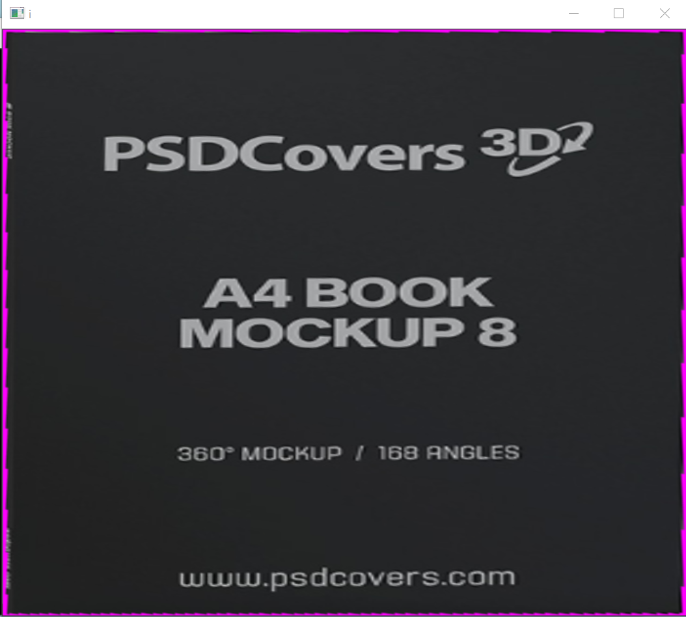

# OCR in C++ using OpenCV and Tesseract Engine
## **Description**
The Optical Character Recognition (OCR) project is a robust and versatile application developed in C++ utilizing the OpenCV library. This project aims to enable the extraction of textual information from images or documents, facilitating the conversion of scanned documents, images, or camera-captured snapshots into editable and searchable text formats.
## **Integration of libraries**
 ### **OpenCV**:
- Initially you need to download the OpenCV into your personal computer, you can install it from the provided link or you can download the updated version according to your requirements. (https://github.com/opencv/opencv/releases/tag/4.5.1)
- Then you need to install it into your PC.
- After a successfull installation of OpenCV you need to include directories of your OpenCV folder into your project along with libraries and dependencies.
- In my case, I am using visual studio community 2022, tally the process with respective IDE's.
+ **To include headers and Library**:
+ Go to your **project properties**, and then to **VC++ directories**.
+ Go to **include directories** and add path: **D:\opencv\build\include**, **D** refers to the disk containing OpenCV.
+ Go to **Libraries directories** and then add path: **D:\opencv\build\x64\vc15\lib**.
+ Navigate into Linker, then to input and add additional dependencies which will be located in your lib folder such as **opencv_world451d.lib**.
 ### **Tesseract Engine**:
- In the beginning of the project, my intention was to include tesseract library into my project in order to make it efficient through vcpkg but after months of struggle and research from different platforms, reading articles and watching videos and unsuccessful attempts I almost gave up and used tesseract engine instead. (https://tesseract-ocr.github.io/tessdoc/Examples_C++.html). 
- I would prefer to go and check this forum if you want to use tesseract library along with your project.(https://stackoverflow.com/questions/50658953/install-tesseract-for-c-on-windows-10)
- Add path of the tesseract folder to your computer environment variable so that cammand prompt get access to OCR.
- If you want to make sure tesseract is successfully installed write in cmd **"tesseract --help"**.
 ### **Integrating wxWidget**:
- At first you need to download zip file of wxWidget from its official website and then navigate to downloads.(https://www.wxwidgets.org/downloads/)
- Extract the zip file into some destination. Letter, navigate to **WxWidget->build->msw->wxvc17.sln**, build it for x32, and x64 it will generate files name **vc_x64_mswu** and **vc_x64_mswud** into the build folder. Note build it with both debug and release configuration.
- Add path of wxwidget folder to your environment variable the way you did with your tesseract OCR engine.
- Go to your IDE and open a new empty project. Navigate to properties of your project. Make sure **configuration=all configuration** and **platform=all platform**.
- Navigate to **C++ -> Additional include directories** then add path to include headers such that **(E:\WXwidgets\include\msvc;E:\WXwidgets\include)**.
- Navigate to **Linker->System** and change subsystem from console to windows.
- Navigate to **Linker->General** then add path to additional library directories according to your system requirements such as **E:\WXwidgets\lib\vc_x64_lib** in case of x32, remember I build files for both x32 and x64. You can add any of each according to your personal requirements.
- Then copy the code from this website if your wxWidget is working fine.(https://pastebin.com/9rb3bcyx).
 ### **GUI and User Interface**
- .
 ### **Procedure**
- Initially we have perform some gaussian blur operation and Image grey operation to detect edges because when we perform gaussian blur, it decreases the intensity of image as a result sharp image get more visible comparatively to our original image.
- After that we have perform some canny edge detection to detect the edges in the image.
- Later on, we have perform dilation to increase the width of the edges such to perform other operations followed by dilation e.g. Warping to enhanced the visibility of text in the image..
- Then we perform dilation by taking vector of points in the image. Initially to detect the boundary we have faced some errors because text also do have edges so when we perform these operations our program also take those points into consideration so it was not providing the required result. That is why we need to be particular, so we implemented a condition that area must be greater than 1000 pixels, when we did it was giving better result but now we were not able to input images with no boundary. Ill discuss it letter following the procedure. .
- By implementing a getcontour function we have extracted the initial points of the boundary, when we implemented a draw points function in our boundary it was randomly allocating the points so in order to eliminate this we have perform some reorder function and got points accordingly. Then we have perform our warping.
- After doing warping we have cropped our image to get better results..
- In order to eliminate the problem we were encountering initially with no boundary images. We have tested our image with random pixel area to detect only contour with largest area, if it does not we have implemented some if else conditions that if it dont it perform some basic operations like thresholding and equalizehist to increase the contrast of an image and make it more visible. If it does, let it perform some warping and concentrate in the text part of the image..
 ### **Samples**
- .
- .
- .
- .

### **Thank You!**
